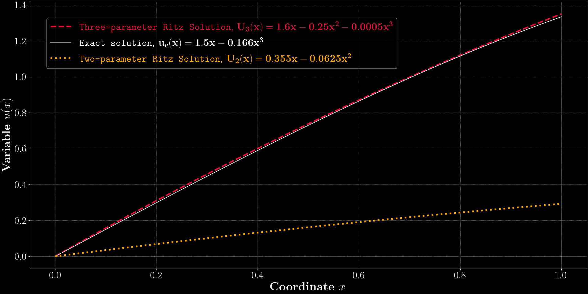
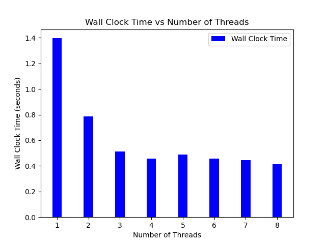

# Matplotlib Library
This repository contains a very simple example on the usage of Matplotlib library of python.

## Matplotlib
Matplotlib is a cross-platform, data visualization and graphical library for Python and its numerical extension NumPy.

The following plot created using `RitzPlot.py` python file in this repository is the visualization of the solution to Ritz method discussed in this [blog](https://medium.com/@SourenAM/ritz-method-a-gateway-to-finite-element-method-b7cc9c8421d2).

The following plot created using `ThreadsTimePlot.py` file in this repository is the visualization of the wall clock time as a function of number of threads in computing pi using parallel programming discussed in this [blog]().

